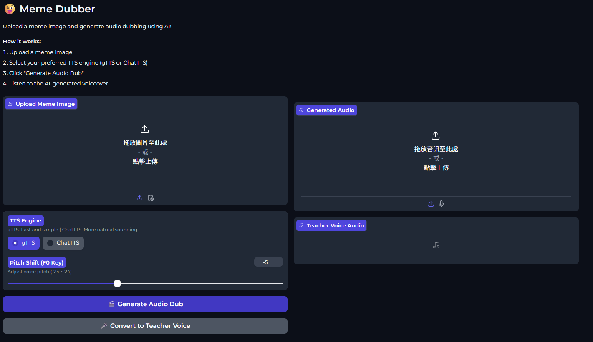
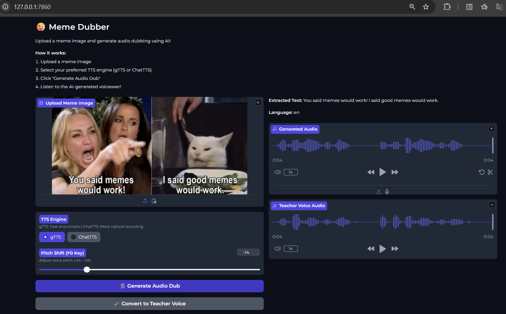
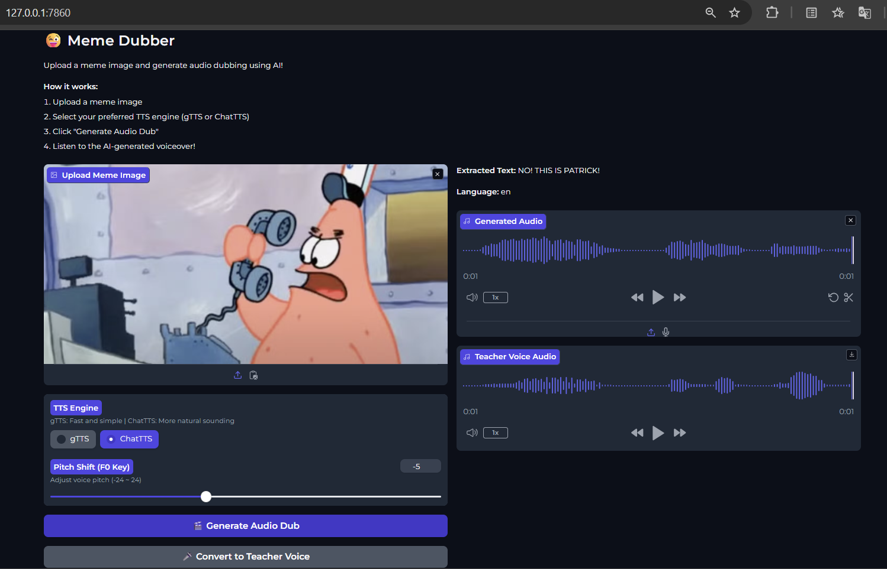

# Meme Dubber



**Meme Dubber** is an AI-powered system that generates speech from meme content and transforms it into a target voice using a model trained with Retrieval-Based Voice Conversion (RVC).


---

## Features

* **Text extraction & dialogue generation**  
  Extracts existing text from meme images or generates meme-style dialogue using the Google Gemini API.

* **Multiple TTS backends**  
  Converts text into speech using either gTTS or ChatTTS.

* **Custom voice conversion (RVC)**  
  Transforms synthesized speech into a target voice using RVC models trained via RVC WebUI.

* **Web-based user interface**  
  Provides a Gradio web interface for uploading images, selecting TTS engines, and downloading dubbed audio.

---


## Prerequisites

- Python 3.8 or higher (3.10 recommended)
- Anaconda or Miniconda installed (recommended for environment management)
- Google API key for Gemini API ([Get one here](https://aistudio.google.com/app/apikey))
- Internet connection (required for gTTS and Gemini API)
- At least 2GB of free disk space (for ChatTTS models)

---

## Installation
Installing `fairseq` on Windows requires compiling C++ extensions.   
If the terminal is not run with **Administrator privileges**, the installation may fail. 
Therefore, it is **strongly recommended** to run the terminal as ***Administrator*** throughout the entire installation process.

### 1. Create Conda Environment and Install Python:
```bash
conda create -n Meme_env python=3.10
conda activate Meme_env
```

### 2. Install PyTorch:
Install PyTorch according to whether you use **CPU** or **GPU**.

* **CPU version**:
```bash
pip install torch==2.9.0+cpu torchaudio==2.9.0+cpu torchvision==0.24.0+cpu --index-url https://download.pytorch.org/whl/cpu
```

* **GPU version (CUDA 11.8 only — required for RVC)**:
```bash
pip install torch torchvision torchaudio --index-url https://download.pytorch.org/whl/cu118
```

> **Why CUDA 11.8?**  
> RVC depends on multiple third-party libraries (e.g., PyTorch, faiss, fairseq),
> and **CUDA 11.8 is the only version that has been verified to work reliably**
> with the complete RVC inference pipeline.

### 3. Install Microsoft Visual C++ Build Tools (C++ Compiler):  
Installing `fairseq` requires compiling C++ extensions, so Windows users must install a C++ compiler.

Follow these steps:
1. Go to https://visualstudio.microsoft.com/visual-cpp-build-tools/
2. Download and run the installer
3. Check the "C++ build tools" workload
4. Also check "Windows 10 SDK" or "Windows 11 SDK"
5. Install and restart your computer if required

> macOS and Linux usually come with a C++ compiler preinstalled, so this step is generally not needed on those systems.

### 4. Clone the Repository and Install Dependencies:

> **Important**  
> Remember to open the terminal with **administrator privileges** and make sure the correct Conda environment is activated before proceeding.  


```bash
git clone https://github.com/ml-team12-meme-dubber/Meme_Dubber Meme_Dubber
cd Meme_Dubber
pip install -r requirements.txt
```

This will install the following key dependencies:

- **fairseq (installed from GitHub, requires C++ compilation)**
    
    Used to extract content features (semantic representations) from input audio, which serve as the intermediate representation in the RVC pipeline.
    
- **faiss-cpu**
    
    Performs efficient K-nearest neighbor (KNN) search on the feature index, enabling fast similarity matching during voice conversion inference.
    
- **inferrvc (.whl package)**
    
    The core RVC inference package that integrates feature extraction, index lookup, and neural voice conversion into a unified pipeline.
    
- **Common audio & ML libraries**
    
    Including `librosa`, `soundfile`, and `scikit-learn`, which are used for audio processing, feature handling, and utility functions.


### 5. Downgrade pip and Install Compatible Package Versions (to Avoid Dependency Conflicts):
To avoid dependency conflicts between `gradio`, `gradio_client`, `websockets`, and `google-genai`, it is recommended to downgrade pip and install specific versions of these packages:

#### (1) Downgrade pip

```bash
# Downgrade pip to improve compatibility
python -m pip install pip==23.2.1
```

#### (2) Install specific compatible versions (Order Matters)
Please install the following packages in the exact order shown below:

```bash
pip install gradio==4.19.2
pip install gradio_client==0.10.1
pip install websockets==15.0.1
pip install google-genai==1.52.0
```

### 6. Modify `inferrvc` Source Code:

#### (1) Enable CPU Mode Works Properly
* Open the following file:  
```bash
<your Conda environment path>\Lib\site-packages\inferrvc\pipeline.py
```

* Locate the following line (approximately line 31):
```python
bh, ah = torch.from_numpy(bh).to(_gpu, non_blocking=True), torch.from_numpy(ah).to(_gpu, non_blocking=True)
```

* Replace it with:
```py
device = "cuda" if torch.cuda.is_available() else "cpu"
bh, ah = torch.from_numpy(bh).to(device), torch.from_numpy(ah).to(device)
```

#### (2) Enable GPU Mode Works Properly
`torchaudio`'s resample module does not support FP16 tensors and may raise an error like:
```bash
RuntimeError: Input type (torch.cuda.HalfTensor) and weight type (torch.cuda.FloatTensor) should be the same
```

To fix this, force the model to use FP32 (float32) instead:  
* Open the file:  
```bash
<your Conda environment path>\Lib\site-packages\inferrvc\configs\config.py
```

* Find all lines containing:
```py
self.is_half = True
```

* Replace them with:
```py
self.is_half = False
```
This ensures RVC uses FP32 inference on both CPU and GPU.


### 7. Configure Environment Variables:
* Copy the example environment file:

```bash
# Linux/macOS
cp .env.example .env

# Windows
copy .env.example .env
```

* Edit `.env` and set your Google API key:
```
GOOGLE_API_KEY=your_actual_api_key_here
```
Replace `your_actual_api_key_here` with the Google API key you obtained.


### 8. Install FFmpeg (Windows Only)

FFmpeg is required for audio processing (e.g., TTS generation, audio conversion, and playback).

> **Note:**  
> The main FFmpeg website highlights source code downloads, which are **not directly usable on Windows**. 
> Please make sure to download a **precompiled Windows binary**, not the source code.


#### Step 1. Download ffmpeg (Windows precompiled build) 
1. Go to the official FFmpeg download page:
  https://ffmpeg.org/download.html
  
2. Under Get packages & executable files, click Windows.

3. Select **Windows builds by BtbN**.

4. Download the following file (or an equivalent Windows 64-bit ZIP build):

```makefile
ffmpeg-master-latest-win64-gpl-shared.zip
```

> ⚠️ Do NOT download files with extensions like `.tar.xz`, `.tar.gz`, or any Source code archives.


#### Step 2. Extract and configure PATH

1. Extract the ZIP file (e.g., to `C:\ffmpeg\`).

2. Make sure the following file exists:
```text
C:\ffmpeg\bin\ffmpeg.exe
```

3. Add the `bin` directory to your system **PATH**:
```text
C:\ffmpeg\bin
```

#### Step 3. Verify installation

After updating the system PATH, restart all terminals and any running Python processes to ensure the changes take effect.

Then open a new terminal and run:

```bash
ffmpeg -version
ffprobe -version
```

If version information is displayed, FFmpeg is successfully installed and available in your system PATH.


---

## Usage

Make sure the required Conda environment is activated before running the project.

```bash
conda activate Meme_env
cd Meme_Dubber
```

### 1. Placing Your RVC Models
> **Note:** This project is intended for educational and personal use only.  
> For demonstration purposes, the RVC model and index files are provided in the **Release** section.  
> Due to privacy concerns, these files will be **removed after the project evaluation is completed**.  
> If you would like to reproduce this project in the future, please download publicly available RVC models from  
> [Hugging Face (example)](https://huggingface.co/models?other=rvc&utm_source).


Please download the following two files from the [**Releases page**](https://github.com/ml-team12-meme-dubber/Meme_Dubber/releases/tag/model_index_output):

- `Teacher_infer.pth` — RVC model weights  
- `Teacher_infer.index` — RVC voice feature index

After downloading, place the files into the corresponding directories as shown below:

```text
Meme_Dubber/
├── asset/                    # ChatTTS model files (auto-downloaded after execution)
│   ├── Decoder.safetensors
│   ├── DVAE.safetensors
│   ├── Embed.safetensors
│   ├── Vocos.safetensors
│   ├── gpt/
│   └── tokenizer/
├── images/
│   ├── inference.png
│   ├── Output_with_text_Meme.png
│   └── Output_without_text_Meme.png
├── index/                    # RVC index files (.index)
│   └── Teacher_infer.index
├── model/                    # RVC model files (.pth)
│   └── Teacher_infer.pth
├── .env                      # API keys (user-created, not tracked by git)
├── .env.example              # Template for environment variables
├── meme_dubber.py            # Main application script
├── meme_audio_gtts.mp3       # Output from gTTS
├── meme_audio_chattts.wav    # Output from ChatTTS
├── README.md                 # Project documentation
└── requirements.txt          # Python dependencies
```


### 2. Start the application:
```bash
python meme_dubber.py
```


### 3. Open the Web Interface:
Open your browser and navigate to:
   ```
   http://127.0.0.1:7860
   ```


### 4. Generate audio:
- Upload a meme image (or paste from clipboard)
- Select a TTS engine:
   - **gTTS**: Faster, requires an internet connection
   - **ChatTTS**: Higher audio quality, works offline after initial setup
- Click "Generate Audio Dub"
- View the extracted/generated text
- Listen to and download the generated audio

#### TTS Engine Comparison

| Feature | gTTS | ChatTTS |
|---------|------|---------|
| Speed | Fast | Slower (initial model download) |
| Audio Quality | Good | More natural |
| Internet | Required | Not required after setup |
| Resource Usage | Low | High (~2GB models) |
| Output Format | MP3 | WAV (24kHz) |


### 5. Adjust `f0_up_key` (Pitch Control)
`f0_up_key` controls the pitch shift (in semitones) applied when converting TTS audio into a custom voice using RVC.

* Use `0` for no pitch change

* Use a negative value to lower the pitch

* Use a positive value to raise the pitch

Suggested values for the provided RVC model:

* **gTTS**: `-14`

* **ChatTTS**: `-5`


---

## Output
After running the application, the system produces the following outputs:

- Text extracted from the meme image or generated by the AI
- Synthesized speech audio generated by the selected TTS engine
- Voice-converted audio (if RVC is enabled), reflecting the target voice

The voice-converted audio can be previewed and downloaded via the Gradio interface.


### Demo

- **With text**: Extracts text from the meme image  
  

- **Without text**: Generates meme-style dialogue  
  

#### Converted audio outputs are available in the [**Releases section**](https://github.com/ml-team12-meme-dubber/Meme_Dubber/releases/tag/model_index_output).


---

## Development

The development focuses on integrating multiple components into a unified end-to-end pipeline, including multimodal text understanding, text-to-speech synthesis, and voice conversion.

### Core Technologies

* **Google Gemini 2.5 Flash** — multimodal model for image understanding and dialogue generation

* **gTTS / ChatTTS** — text-to-speech backends for speech synthesis

* **RVC WebUI** — used offline to train voice models and build feature indices  

* **RVC inference** — converts synthesized speech into a target voice using trained voice models 

* **Gradio** — web-based interface for rapid prototyping and user interaction  

* **PyTorch & Transformers** — backend frameworks supporting ChatTTS and model inference

### Processing Pipeline

```text
Meme Image
 → Gemini (OCR / dialogue)
 → TTS (gTTS / ChatTTS)
 → RVC (voice conversion)
 → Output audio
```

---

## How It Works

### Text Extraction & Dialogue Generation

1. **Meme Image Input**  
   The user uploads a meme image through the Gradio web interface.

2. **Multimodal Analysis**  
   The image is analyzed by **Google Gemini 2.5 Flash**, which understands both visual content and embedded text.

3. **Adaptive Text Handling**  
   - If clear text is detected, it is extracted directly.  
   - Otherwise, Gemini generates a meme-style dialogue based on the image content.

4. **Structured Output**  
   The system produces structured text content along with detected language information.


### Audio Generation & Voice Conversion

1. **TTS Selection and Speech Synthesis**  
   The user selects a text-to-speech engine (gTTS or ChatTTS) to synthesize speech:  
   - **gTTS** generates speech via Google’s cloud-based TTS service.  
   - **ChatTTS** synthesizes speech locally using a PyTorch-based model.

2. **Voice Conversion (Optional)**  
   The synthesized speech is transformed into a target voice using **RVC-based voice conversion**.

3. **Playback & Download**  
   The final audio is played in the browser and can be downloaded by the user.


---


## Troubleshooting

#### Cannot install dependencies (`pip install -r requirements.txt` fails)
- On Windows, this is usually caused by **not running the terminal as Administrator**
- Please reopen the terminal **as Administrator** and retry the installation

#### "GOOGLE_API_KEY not found"
- Make sure a `.env` file exists in the project root  
  (see **Installation – Step 7** for setup instructions)
- Verify your API key is correctly set in the `.env` file: `GOOGLE_API_KEY=your_key_here`
- Ensure there are no extra spaces or quotation marks
- Restart the application after updating the `.env` file

#### "No text found in the image"
- The Google Gemini API key may be invalid or expired
- Try generating a new API key and updating the `.env` file
- Restart the application after changing the API key

#### ChatTTS takes a long time on first run
- ChatTTS downloads model files (~2GB) during the first execution
- This is expected behavior; please wait until the download completes

#### gTTS does not work
- gTTS requires an active internet connection
- Check your network connectivity
- If offline usage is needed, consider switching to **ChatTTS** (after initial setup)

---

## Reference Repositories
The following open-source repositories were referenced or utilized in this project:

* **Gradio-based Multimodal Interface with TTS and Gemini (developed by a team member)**  
  Used as the foundation for the web-based interface, integrating image-to-text analysis via Gemini
  and text-to-speech (TTS) audio generation. 
  https://github.com/YY-BOY/ml

* **RVC WebUI**  
  Used for training voice conversion models and building feature indices.  
  https://github.com/RVC-Project/Retrieval-based-Voice-Conversion-WebUI

* **RVC Inference**  
  Referenced for integrating the RVC inference pipeline into the project.  
  https://github.com/CircuitCM/RVC-inference


---

## License

This project is for **educational and personal use only**.
